# Sublime - Odoo
## Snippets
Add some snippets for common code
- new model
- overwrite a model
- views (form, list, kanban, search, etc)
- common methods (create, write, etc)

Check the snippet folder to see what's available.

## Syntax highlighting
Syntax highlighting for QWeb templates, OWL templates, views, and access CSV files.

Choose "XML - Odoo", and it will automatically choose the right syntax
- OWL syntax (with JS in expression) if inside `<templates/>`
- View syntax (with python in expression) if inside `<odoo/>`

<p align="center">
  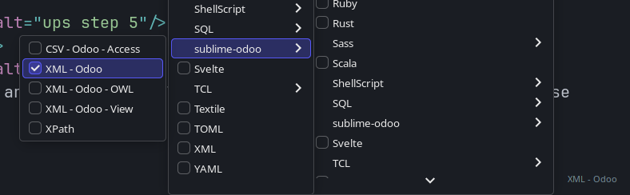
</p>

It highlight JS template inside Python template (eg template of kanban views)

<p align="center">
  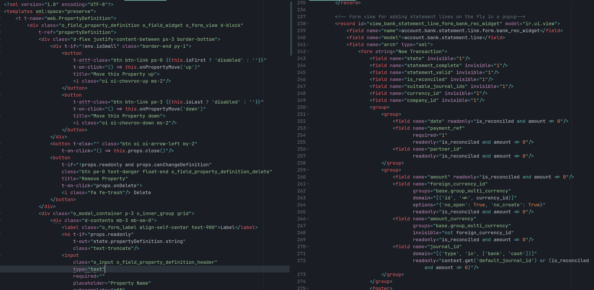
</p>

It also highlight mail templates and "backend" templates.
<p align="center">
  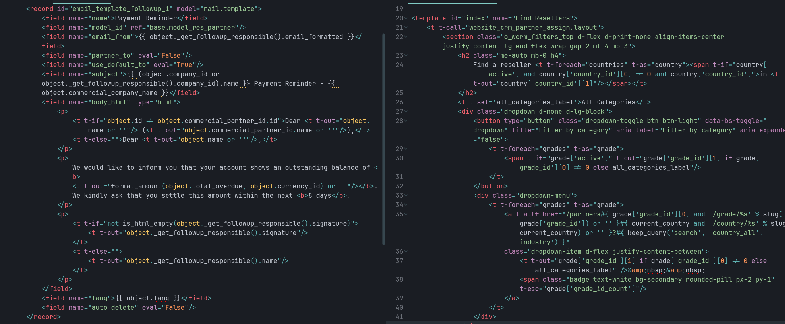
</p>

And ir.model.access.csv
<p align="center">
  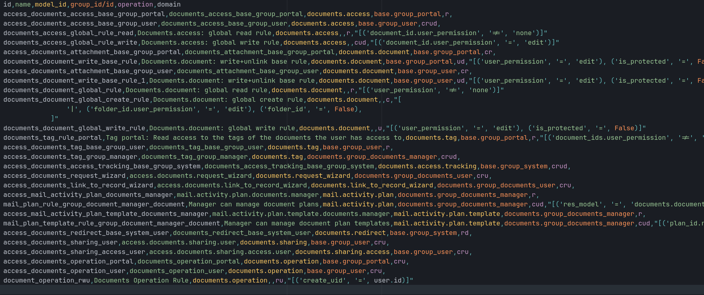
</p>

With this syntax highlighting comes the symbols, you can jump to view / component template with `ctrl+r` / `ctrl+shift+r`
<p align="center">
  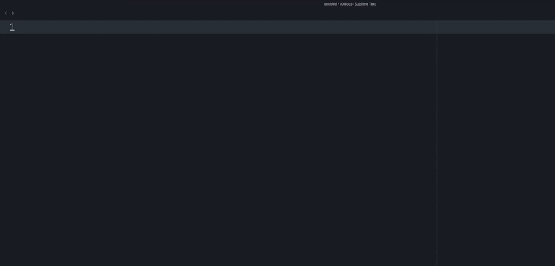
</p>

## Go To Definition
You can configure key bind to make "go to definition" work in views / OWL components
(it uses sublime text symbols indexes, and so many results can be returned, they are sorted with a heuristic,
similar filenames are displayed first).

```json
// Standard sublime text `goto_definition`
{ "keys": ["primary+d"], "command": "goto_definition" },
// When the LSP has the feature
{
  "keys": ["primary+d"],
  "command": "lsp_symbol_definition",
  "context": [
    { "key": "lsp.session_with_capability", "operand": "definitionProvider" },
    { "key": "auto_complete_visible", "operand": false }
  ]
},
// Custom Odoo "Go To Definition"
{
  "keys": ["primary+d"],
  "command": "goto_definition_odoo_xml",
  "context": [{ "key": "selector", "operator": "equal", "operand": "text.xml.odoo-view, text.xml.owl, text.xml.odoo" }]
},
```

Same for `goto_reference`.
```json
{ "keys": ["primary+shift+r"], "command": "goto_reference" },
{
  "keys": ["primary+shift+r"],
  "command": "goto_reference_odoo_xml",
  "context": [{ "key": "selector", "operator": "equal", "operand": "text.xml.odoo-view, text.xml.owl, text.xml.odoo" }]
},
```


<p align="center">
  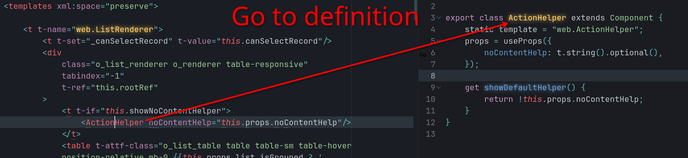
</p>

<p align="center">
  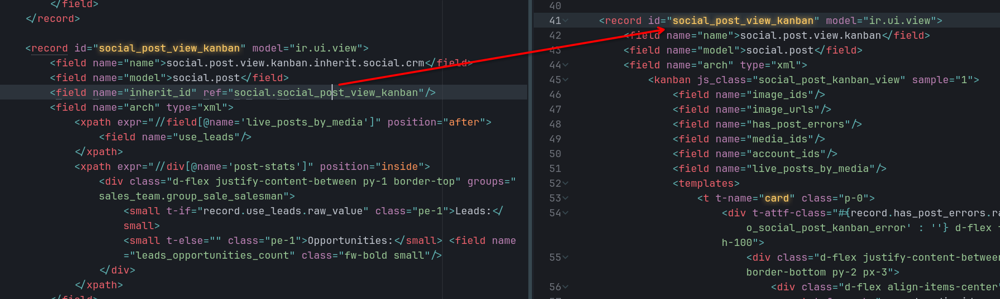
</p>

<p align="center">
  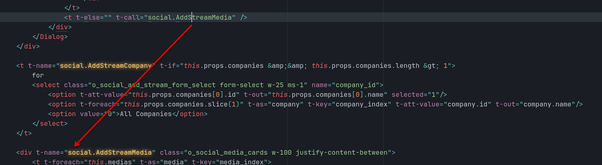
</p>

<p align="center">
  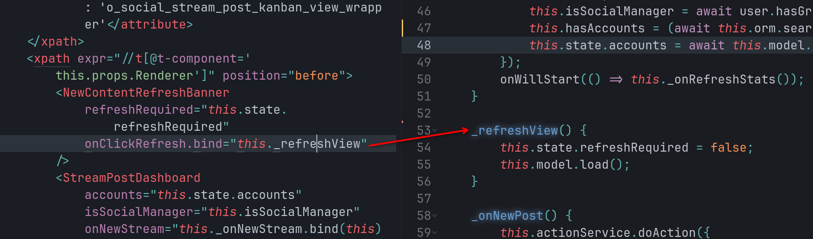
</p>

<p align="center">
  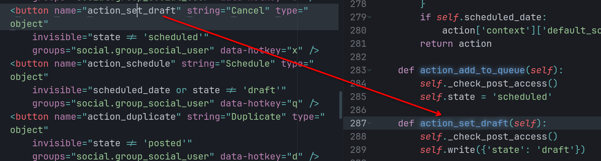
</p>

<p align="center">
  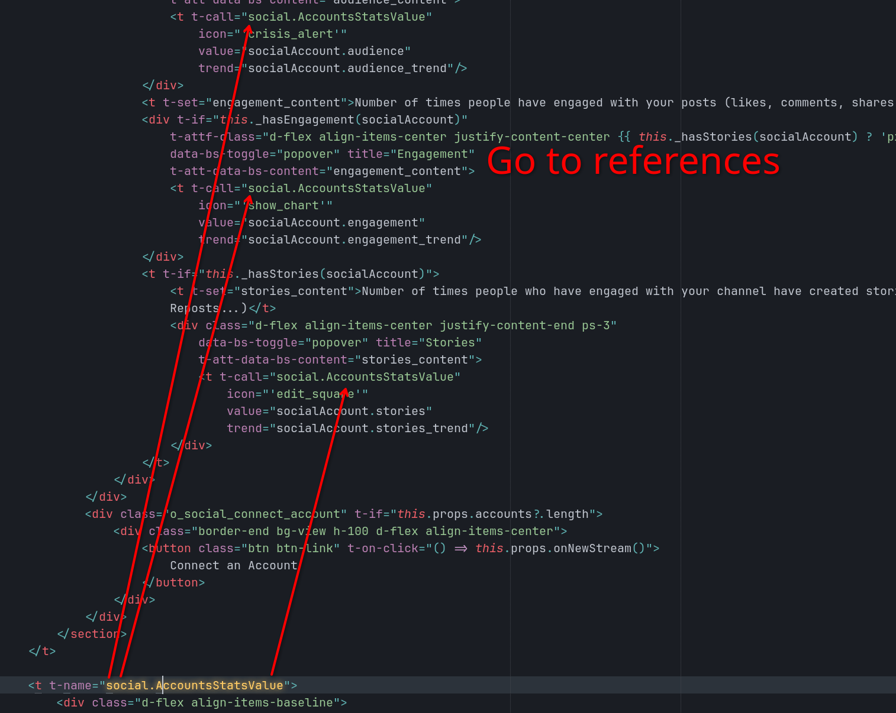
</p>


## Commands
Please install [ripgrep](https://github.com/BurntSushi/ripgrep) to use most of commands (they are use instead of slow python code to get the list of modules, list of models, etc)

> sudo apt install ripgrep

You can automatically create Python inherit, JS component, search a view and overwrite it, etc
<p align="center">
  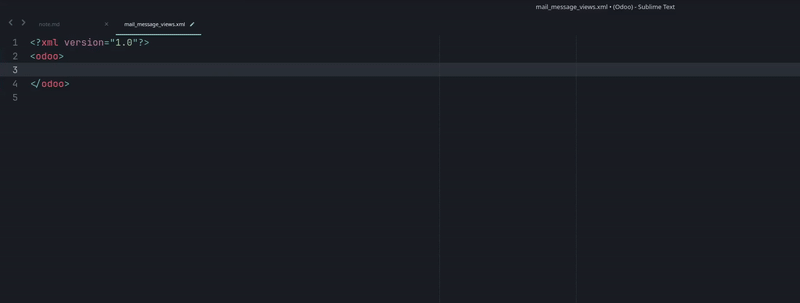
</p>

Type "Odoo" in the command palette to see what's available.
> https://youtu.be/lkYhHB83vJ8

## Auto-complete
<p align="center">
  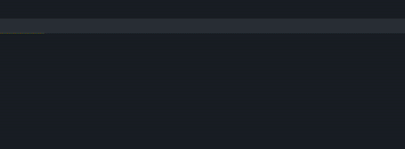
</p>

## TODO
- find a way to automatically change `__manifest__.py` without reformatting
- automatically insert the python import at the right place
